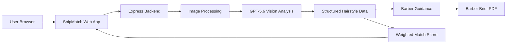

# SnipMatch

AI-powered hairstyle comparison that helps people communicate better with their barbers.

SnipMatch compares a user's current hairstyle with a reference hairstyle, identifies the key differences, and transforms them into clear, professional, barber-ready instructions.

Instead of judging appearance or defining what looks "better", SnipMatch focuses on one goal: helping users explain the haircut they want.

## Demo

Live Demo: https://snipmatch.onrender.com/

## Project Overview

A reference photo can show the hairstyle someone wants, but it rarely explains what needs to change from their current haircut.

This creates a communication gap between customers and barbers. Users often know the result they want, but they struggle to describe the technical details behind that style.

SnipMatch creates a shared language between customers and barbers by analyzing hairstyle differences across four observable dimensions:
- Volume
- Length
- Texture
- Silhouette

The result is a structured consultation report with evidence-based observations, adjustable priorities, and practical barber instructions.

Users can also generate a Barber Brief PDF to bring directly to their appointment.

## Features

### AI Hairstyle Comparison

Upload your current hairstyle photo and a reference hairstyle photo. SnipMatch analyzes the differences between the two hairstyles using four key dimensions:
- Volume
- Length
- Texture
- Silhouette

### Explainable Haircut Analysis

Instead of providing a single black-box similarity score, SnipMatch generates structured observations with supporting evidence, helping users understand exactly what needs to change.

### Personalized Match Score

Users can adjust the importance of each dimension based on their personal preferences.

For example:
- Someone growing out their hair can prioritize Length.
- Someone looking for a specific style can prioritize Texture or Silhouette.

The Match Score updates instantly without requiring another AI request.

### Barber-Ready Instructions

SnipMatch transforms visual differences into practical haircut guidance using professional terminology that helps customers communicate more clearly with barbers.

### Personal Haircut Requirements

Users can provide non-negotiable preferences, such as:

- Keep the hair below the ears.
- Do not cut the fringe too short.
- Avoid removing too much volume.

SnipMatch translates these preferences into professional consultation notes and checks for potential conflicts with the target hairstyle.

### Reference Style Recognition

SnipMatch estimates the reference hairstyle name with confidence scoring to help users better describe their desired haircut.

### Barber Brief PDF

Generate a clean, downloadable PDF summary that users can bring directly to their barber appointment.

### Consistent AI Analysis

Input images are normalized and analysis results are cached to improve consistency and reduce unnecessary AI requests.

## AI Features

SnipMatch uses GPT-5.6-powered vision capabilities to transform hairstyle images into structured, explainable haircut guidance.

The AI workflow is designed around two stages:

### Stage 1: Hairstyle Analysis

The vision model analyzes the current hairstyle and reference hairstyle across eight observable hair regions.

It extracts structured information for four key dimensions:

- Volume
- Length
- Texture
- Silhouette

For each dimension, the model provides:
- score estimation
- confidence level
- supporting visual evidence

This structured approach helps avoid relying on a single subjective similarity score.

### Stage 2: Professional Barber Guidance

A second AI step converts validated hairstyle observations into practical barber consultation instructions.

The generated guidance focuses on:
- what should change
- where the change should happen
- how to communicate the change professionally

The goal is not to judge whether a hairstyle is attractive, but to help users explain their preferences more clearly.

### Reference Style Recognition

SnipMatch estimates a concise name for the reference hairstyle and provides a confidence score.

When confidence is low, the system avoids overclaiming and uses a generic reference label instead.

### Personalized Requirements

Users can provide personal haircut requirements, such as keeping certain lengths or avoiding specific changes.

AI translates these preferences into professional consultation language and identifies possible conflicts with the target hairstyle.

### Reliability and Consistency

To improve reliability, SnipMatch separates AI interpretation from application logic.

The AI provides structured observations, while the application calculates the final weighted Match Score deterministically.

Changing user priorities only recalculates the score locally and does not trigger another AI request.

All AI requests and API keys remain strictly server-side.

## Development with Codex & GPT-5.6

Codex played an important role throughout the development of SnipMatch, accelerating implementation, debugging, testing, and deployment preparation.

Instead of replacing product decisions, Codex helped transform ideas into a working product by assisting with engineering tasks and improving iteration speed.

Key areas where Codex accelerated development:

### Backend Development

Codex helped build and refine the Node.js + Express backend, including:

- OpenAI API integration
- image upload handling
- structured JSON response processing
- server-side security practices
- environment variable configuration

### AI Workflow Design

Codex helped iterate on the AI analysis pipeline, including:

- designing structured hairstyle analysis outputs
- improving prompt reliability
- separating AI interpretation from deterministic application logic
- reducing inconsistent AI-generated scoring

### Debugging and Testing

Codex assisted with:

- identifying deployment issues
- debugging API integration problems
- improving error handling
- validating repeated image analysis consistency

### Deployment and Documentation

Codex accelerated:

- GitHub repository preparation
- Render deployment configuration
- README creation and refinement
- security reviews before public release

GPT-5.6 was used within Codex for architecture review, reasoning about AI workflow design, improving code quality, and validating the final implementation.

The final product combines human product decisions with AI-assisted development to create a more reliable and user-focused experience.

## Architecture

SnipMatch uses a simple full-stack architecture designed for fast iteration and reliable AI-powered analysis.

The application runs as a single Node.js + Express service:




### Data Flow

1. Users upload:
   - current hairstyle image
   - reference hairstyle image

2. The backend processes and normalizes the images before sending them to the AI analysis pipeline.

3. GPT-5.6 analyzes observable hairstyle features and returns structured information across four dimensions:
   - Volume
   - Length
   - Texture
   - Silhouette

4. The application validates the AI output and generates:
   - hairstyle comparison insights
   - barber-ready instructions
   - personalized consultation notes

5. The browser calculates the final weighted Match Score locally based on user-selected priorities.

6. Users can export the final consultation report as a Barber Brief PDF.

This architecture separates AI interpretation from application logic, allowing flexible AI analysis while maintaining consistent scoring, user control, and secure server-side API handling.

## Local Setup

### Requirements

- Node.js 18+
- An OpenAI-compatible API key

### Installation

Clone the repository:

```bash
git clone https://github.com/your-username/SnipMatch.git
cd SnipMatch

## Environment Variables

The backend uses environment variables to configure AI services and server settings.

| Variable | Description |
|---|---|
| OPENAI_API_KEY | Server-side API credential. Never expose this key to frontend code. |
| OPENAI_BASE_URL | Optional OpenAI-compatible API endpoint configuration. |
| VISION_MODEL | Vision model used for hairstyle analysis. |
| REPORT_MODEL | Model used for generating professional barber guidance. |
| PORT | Server listening port. Defaults to 3000. |

For production deployment, configure these values using Render Environment Variables.

Never commit `.env` files or API keys to GitHub.

## Deployment on Render

SnipMatch can be deployed as a single Node.js web service.

Steps:

1. Connect the GitHub repository to Render.

2. Create a new Web Service.

3. Configure:

Build Command:

```bash
npm install

## API

SnipMatch uses a small Express API layer to securely connect the frontend with AI-powered analysis.

### POST /api/analyze

Main hairstyle comparison endpoint.

Input:
- Current hairstyle image
- Reference hairstyle image

The backend:
- normalizes uploaded images
- sends images to the AI analysis pipeline
- validates the structured response
- returns hairstyle comparison data to the frontend

The response includes:

- four hairstyle dimension analyses
- confidence and supporting evidence
- professional barber guidance
- reference style metadata

### POST /api/generate-report

Optional endpoint used when users provide personal haircut requirements.

It converts user preferences into professional barber consultation language and identifies possible conflicts with the target hairstyle.

All AI requests are handled server-side.

## AI Output Consistency Validation

One challenge with AI-powered visual analysis is that repeated requests can sometimes produce slightly different outputs.

To improve reliability, SnipMatch separates AI observation from score calculation.

The AI provides:
- visual observations
- dimension analysis
- confidence levels

The application calculates the final weighted Match Score using deterministic logic.

SnipMatch includes a consistency validation script to measure repeated analyses of the same image pair.

Example:

```bash
npm run test:consistency -- --current ./current.jpg --reference ./reference.jpg --runs 5 --url http://localhost:3000

## Privacy and Safety

SnipMatch focuses on hairstyle communication, not appearance evaluation.

It does not:
- rate attractiveness
- judge beauty
- perform face synthesis
- generate virtual try-on images

The product analyzes hairstyle characteristics to help users communicate preferences with barbers more clearly.

Uploaded images are processed only for the requested hairstyle analysis.

All API keys remain server-side and are excluded from Git.

Sensitive files including:
- .env files
- local caches
- test images
- temporary files

are excluded through Git configuration.

## Future Improvements

SnipMatch focuses on improving communication between customers and barbers. Future improvements will continue to make this communication more personalized, accurate, and useful.

### More Personalized Hair Preferences

Future versions could allow users to provide more detailed preferences before analysis, such as:

- Which parts of their current hairstyle they want to keep
- Which areas they want to change
- Which hairstyle features from the reference image matter most

This would allow SnipMatch to better understand individual goals instead of treating every hairstyle comparison the same way.

### More Detailed Reference Analysis

Future versions could allow users to highlight specific areas of the reference hairstyle they want to prioritize, such as:

- fringe
- sides
- crown
- neckline
- texture on top

This would help users communicate exactly which elements of a reference hairstyle are most important.

### Expanding Hairstyle Knowledge

Professional haircut terminology and styling knowledge are highly specialized.

A future direction is building a richer hairstyle knowledge base by incorporating more professional barber knowledge, haircut terminology, and real-world consultation examples.

The goal is not to define what makes a hairstyle "beautiful", but to help users and professionals communicate more precisely.

### Better Real-World Robustness

Future improvements could include:

- better handling of different lighting conditions
- more guidance for taking hairstyle photos
- improved analysis across different hair types and styles
- broader multilingual barber terminology support

Ultimately, SnipMatch aims to become a communication layer between personal hairstyle preferences and professional haircut expertise.


