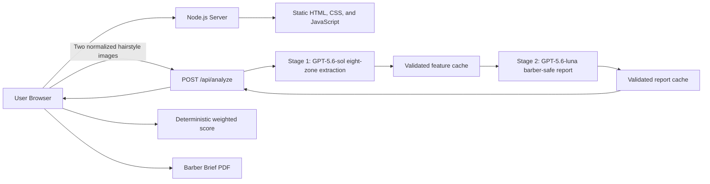

# SnipMatch

SnipMatch compares a user's current hairstyle with a reference hairstyle and turns the visible differences into clear, barber-ready instructions. It is designed to improve haircut consultations—not to evaluate appearance or attractiveness.

## Demo

**Live Demo:** To be added after Railway deployment

## Project Overview

A reference photo can show the look someone wants, but it rarely explains what must change in their current haircut. SnipMatch gives clients and barbers a shared technical starting point by comparing two uploaded hairstyle photos across four observable dimensions: Volume, Length, Texture, and Silhouette.

The result is a structured web report with evidence, confidence, adjustable priorities, and practical consultation notes. A downloadable Barber Brief turns the same analysis into an appointment-ready PDF.

## Features

- Upload a current hairstyle photo and a reference hairstyle photo
- AI-powered visual hairstyle comparison
- Volume, Length, Texture, and Silhouette scores with confidence and evidence
- Deterministic Overall Match Rate calculation
- User-adjustable analysis priorities that recalculate instantly
- Region-specific, evidence-bound barber consultation instructions
- Optional Client Non-Negotiable with a professional translation and target-style conflict note
- AI-estimated reference style name with confidence gating
- Downloadable SnipMatch Barber Brief PDF
- Normalized image inputs and analysis caching for more consistent repeat results

## AI Features

CrazyRouter's OpenAI-compatible gateway is used only by the Node.js backend to access vision-capable GPT models. It:

- Stage 1 uses GPT-5.6-sol vision to analyze the normalized current and reference hairstyle images across eight spatial hair zones;
- Stage 1 returns strict structured scores, confidence, evidence, and spatial observations for Volume, Length, Texture, and Silhouette;
- Stage 2 uses GPT-5.6-luna to turn only the validated observations into region-specific barber guidance under 13 anti-fabrication rules;
- estimates a concise reference hairstyle name and confidence from the reference image alone; and
- when supplied, translates a Client Non-Negotiable and checks it for conflicts with the reference hairstyle in a separate GPT-5.6-luna request.

The server validates Stage 1 JSON before Stage 2 can use it, then validates the professional report for banned filler, invented measurements, and unsupported tools or techniques. The browser calculates the final weighted Overall Match Rate deterministically. Changing priorities never makes another AI provider request. The optional non-negotiable is a communication overlay only and never enters feature extraction, caching, dimension scores, or the Overall Match Rate. The CrazyRouter API key and every AI request remain server-side.

## Architecture



The project intentionally uses no frontend framework, build tool, database, Docker image, or serverless layer. The built-in Node.js HTTP server serves the static frontend and the analysis endpoint from one Railway service.

## Local Setup

Requirements:

- Node.js 18 or newer
- A CrazyRouter API key

```powershell
Copy-Item .env.example .env
npm install
npm start
```

Set your local `.env` values before starting:

```dotenv
CRAZYROUTER_API_KEY=your_key_here
CRAZYROUTER_BASE_URL=https://crazyrouter.com/v1
VISION_MODEL=gpt-5.6-sol
REPORT_MODEL=gpt-5.6-luna
PORT=3000
```

Open `http://localhost:3000`.

## Environment Variables

| Variable | Required | Description |
| --- | --- | --- |
| `CRAZYROUTER_API_KEY` | Yes | Server-side CrazyRouter credential. Never expose it to browser code. |
| `CRAZYROUTER_BASE_URL` | No | OpenAI-compatible endpoint. Defaults to `https://crazyrouter.com/v1`. |
| `VISION_MODEL` | No | Stage 1 hair feature and reference-style model. Defaults to `gpt-5.6-sol`. |
| `REPORT_MODEL` | No | Stage 2 professional-report and Non-Negotiable model. Defaults to `gpt-5.6-luna`. |
| `PORT` | No | Listening port. Defaults to `3000`; Railway supplies this in production. |

## API

`POST /api/analyze`

The browser corrects image orientation, limits the longest edge to 1280 pixels, preserves aspect ratio, and encodes both images as JPEG at a fixed quality before submission.

```json
{
  "currentImage": "data:image/jpeg;base64,...",
  "referenceImage": "data:image/jpeg;base64,..."
}
```

A successful response contains four validated dimension objects, all eight spatial-zone objects, the Stage 2 professional report, display-only reference style metadata, cache status, and version metadata. User priorities are deliberately excluded from model requests and cache keys.
`POST /api/generate-report`

This optional endpoint receives only the Client Non-Negotiable and normalized reference image. It returns a professional barber translation and, when needed, a consultation note. The browser does not call it when the textarea is empty.

```json
{
  "nonNegotiable": "No skin fade. Keep my fringe below my eyebrows.",
  "referenceImage": "data:image/jpeg;base64,..."
}
```

## Consistency Test

With the server running, execute repeated uncached analyses of the same pair:

```powershell
npm run test:consistency -- --current .\current.jpg --reference .\reference.jpg --runs 5 --url http://localhost:3000
```

The test reports each dimension's values, mean, variance, standard deviation, minimum, maximum, and range.

## Deploy on Railway

1. Create a Railway project from the public GitHub repository.
2. Add `CRAZYROUTER_API_KEY`, `CRAZYROUTER_BASE_URL`, `VISION_MODEL`, and `REPORT_MODEL` in the service's **Variables** settings.
3. Deploy the repository. Railway detects the Node.js start script automatically.
4. In **Settings → Networking**, generate a Railway domain.
5. Verify the homepage and one complete analysis through the public URL.

Do not upload `.env`; Railway environment variables are the only place the production CrazyRouter key should be stored.

## Privacy and Safety

- SnipMatch compares hairstyle geometry; it does not rate attractiveness.
- It does not provide virtual try-on, face synthesis, or image generation.
- Uploaded images are sent only from the browser to the SnipMatch backend and then through CrazyRouter for the requested analysis.
- Secrets, local caches, test photos, virtual environments, and model checkpoints are excluded from Git.


