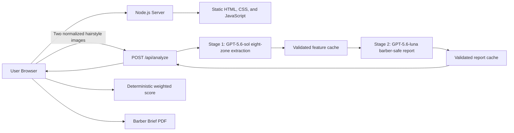

# SnipMatch

SnipMatch compares a user's current hairstyle with a reference hairstyle and turns the visible differences into clear, barber-ready instructions. It is designed to improve haircut consultations—not to evaluate appearance or attractiveness.

## Demo

**Live Demo:** To be added after Railway deployment

## Project Overview

A reference photo can show the look someone wants, but it rarely explains what must change in their current haircut. SnipMatch gives clients and barbers a shared technical starting point by comparing two uploaded hairstyle photos across four observable dimensions: Volume, Length, Texture, and Silhouette.

The result is a structured web report with evidence, confidence, adjustable priorities, and practical consultation notes. A downloadable Barber Brief turns the same analysis into an appointment-ready PDF.

## Features

- Upload a current hairstyle photo and a reference hairstyle photo
- AI-powered visual hairstyle comparison
- Volume, Length, Texture, and Silhouette scores with confidence and evidence
- Deterministic Overall Match Rate calculation
- User-adjustable analysis priorities that recalculate instantly
- Region-specific, evidence-bound barber consultation instructions
- Optional Client Non-Negotiable with a professional translation and target-style conflict note
- AI-estimated reference style name with confidence gating
- Downloadable SnipMatch Barber Brief PDF
- Normalized image inputs and analysis caching for more consistent repeat results

## AI Features

SnipMatch employs a two-stage reasoning pipeline powered by **GPT-5.6** via a standardized OpenAI-compatible API endpoint. This architecture decouples the application from specific inference providers, ensuring high availability and flexibility.

- **Stage 1 (Spatial Analysis):** **GPT-5.6-sol** analyzes normalized current and reference images across eight spatial hair zones. It returns strictly structured scores, confidence levels, and spatial evidence for Volume, Length, Texture, and Silhouette.
- **Stage 2 (Professional Synthesis):** **GPT-5.6-luna** converts only the validated Stage 1 observations into region-specific barber guidance, operating under 13 strict anti-fabrication rules to prevent hallucinations.
- **Style Identification:** Estimates a concise reference hairstyle name and confidence score directly from the reference image.
- **Constraint Validation:** When supplied, a separate **GPT-5.6-luna** request translates "Client Non-Negotiable" preferences into professional terminology and checks for conflicts with the target style.

**Engineering Safeguards:**
The server rigorously validates Stage 1 JSON before synthesis. The generated professional report is scanned for banned filler words, invented measurements, and unsupported techniques. The browser calculates the final weighted Overall Match Rate deterministically. Adjusting user priorities triggers a local recalculation rather than a new AI request, preserving rate limits and consistency. The optional non-negotiable serves purely as a communication overlay and is isolated from feature extraction, caching, and core scoring logic. All API keys and AI requests remain strictly server-side.

## Architecture



The project intentionally uses no frontend framework, build tool, database, Docker image, or serverless layer. The built-in Node.js HTTP server serves the static frontend and the analysis endpoint from one Railway service.

## Local Setup

Requirements:​ Node.js 18+ and an OpenAI-compatible API key (supports sk-cr-xxxformat keys from compatible inference providers). 
Quick Start:​ Run Copy-Item .env.example .env, then npm install, and npm start. 
Configuration:​ Populate .envwith OPENAI_API_KEY=your_key_here, OPENAI_BASE_URL=https://api.crazyrouter.com/v1, VISION_MODEL=gpt-5.6-sol, REPORT_MODEL=gpt-5.6-luna, and PORT=3000. 
Note: This setup mirrors the production Render environment to eliminate environment-specific bugs, featuring fallback logic for seamless switching between inference backends. Launch http://localhost:3000 to access the local demo.

## Environment Variables

The following environment variables configure the backend. OPENAI_API_KEY​ is required; all others are optional and defaulted. 
- OPENAI_API_KEY: Server-side API credential (accepts OpenAI or compatible keys such as sk-cr-xxx); never expose this to browser code. 
- OPENAI_BASE_URL: OpenAI-compatible inference endpoint; defaults to https://api.crazyrouter.com/v1. 
- VISION_MODEL: Stage 1 spatial hair analysis model; defaults to gpt-5.6-sol. 
- REPORT_MODEL: Stage 2 professional report and constraint validation model; defaults to gpt-5.6-luna. 
- PORT: Listening port for the HTTP server; defaults to 3000, though Render auto-injects this value in production environments.

## API

`POST /api/analyze`

The browser corrects image orientation, limits the longest edge to 1280 pixels, preserves aspect ratio, and encodes both images as JPEG at a fixed quality before submission.

```json
{
  "currentImage": "data:image/jpeg;base64,...",
  "referenceImage": "data:image/jpeg;base64,..."
}
```

A successful response contains four validated dimension objects, all eight spatial-zone objects, the Stage 2 professional report, display-only reference style metadata, cache status, and version metadata. User priorities are deliberately excluded from model requests and cache keys.
`POST /api/generate-report`

This optional endpoint receives only the Client Non-Negotiable and normalized reference image. It returns a professional barber translation and, when needed, a consultation note. The browser does not call it when the textarea is empty.

```json
{
  "nonNegotiable": "No skin fade. Keep my fringe below my eyebrows.",
  "referenceImage": "data:image/jpeg;base64,..."
}
```

## Consistency Test

With the server running, execute repeated uncached analyses of the same pair:

```powershell
npm run test:consistency -- --current .\current.jpg --reference .\reference.jpg --runs 5 --url http://localhost:3000
```

The test reports each dimension's values, mean, variance, standard deviation, minimum, maximum, and range.

## Deploy on Render

1. Create a new Render Web Service​ from your GitHub repository.
2. Add the following variables in the service's Environment​ settings:
- OPENAI_API_KEY: Your OpenAI-compatible API key (e.g., sk-cr-xxxformat).
- OPENAI_BASE_URL: https://api.crazyrouter.com/v1.
- VISION_MODEL: gpt-5.6-sol.
- REPORT_MODEL: gpt-5.6-luna.
3. Keep the Build Command as npm installand the Start Command as npm start.
4. Render will automatically build and deploy. Once live, click the generated link (e.g., https://snipmatch.onrender.com)
5. Verify the homepage and complete a full analysis cycle via the public URL.
6. Never commit your .envfile; production secrets must reside exclusively in Render's Environment Variables.

## Privacy and Safety

- SnipMatch compares hairstyle geometry; it does not rate attractiveness.
- It does not provide virtual try-on, face synthesis, or image generation.
- Uploaded images are sent only from the browser to the SnipMatch backend and then through CrazyRouter for the requested analysis.
- Secrets, local caches, test photos, virtual environments, and model checkpoints are excluded from Git.


